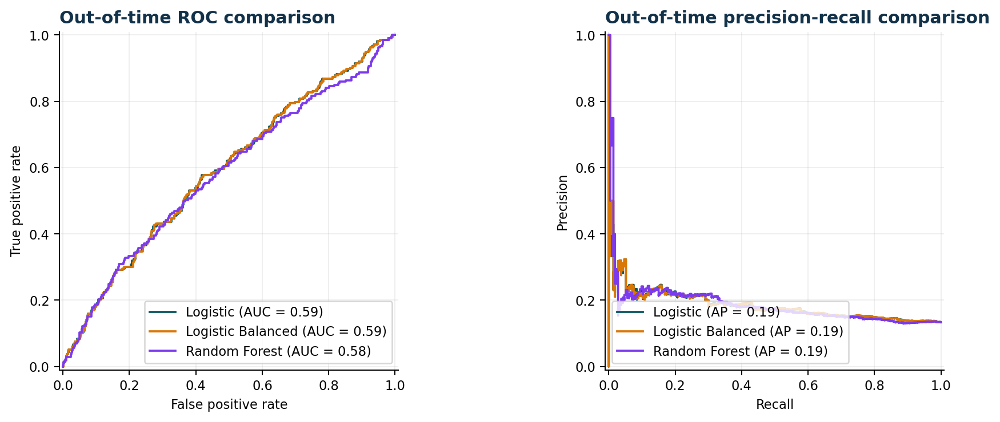
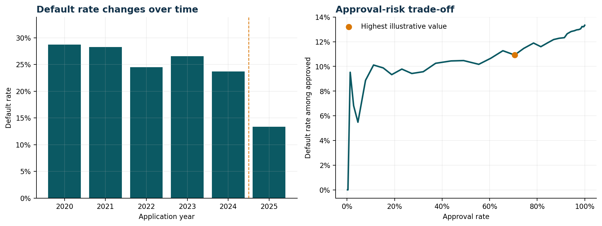
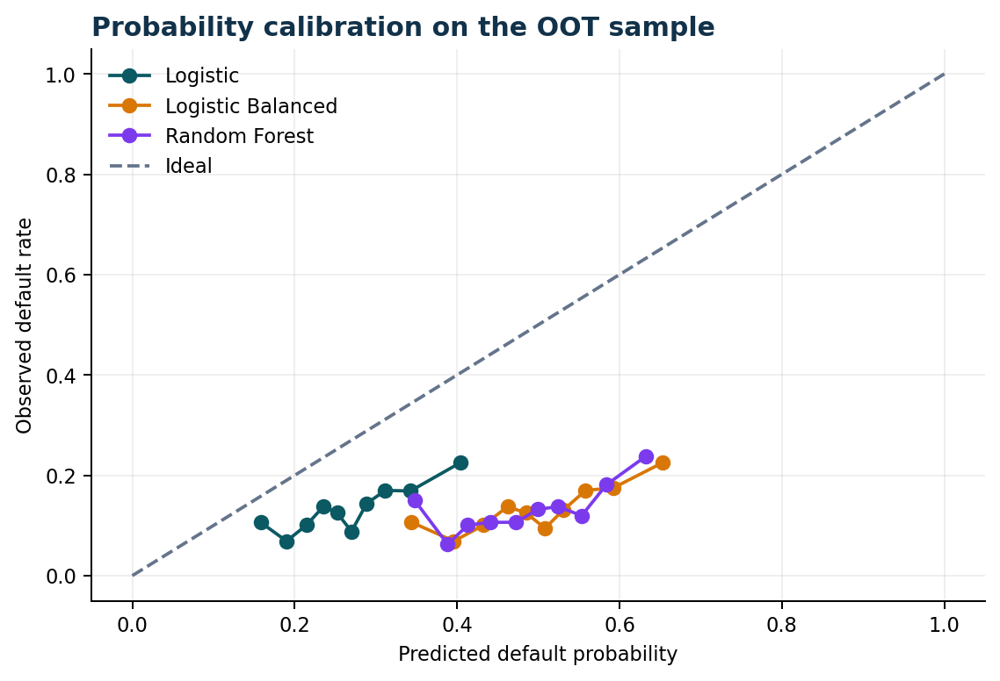
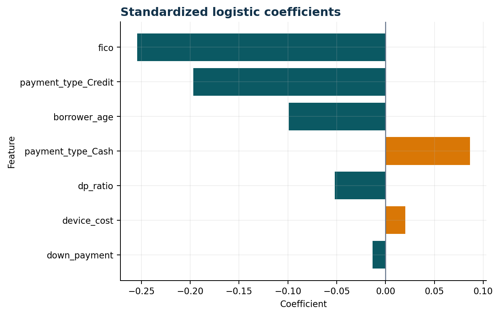

# Device Financing Credit Risk Modeling

English | [简体中文](README.zh-CN.md)

An interpretable credit-risk case study for device financing. The project develops a logistic probability-of-default baseline, tests it on a strict out-of-time sample, compares it with class-balanced and nonlinear alternatives, and connects model scores to an approval strategy under explicit economic assumptions.

> Academic portfolio project using an instructor-simulated dataset. This repository is not affiliated with, endorsed by, or based on internal data from Verizon. It is not a production lending system.



## Executive findings

- The source contains **12,000 applications** from January 2020 through September 2025 with an overall 24.6% default rate.
- Applications before January 1, 2025 form the development sample; **1,597 applications from 2025** form the untouched out-of-time test set.
- The interpretable logistic model achieved **0.590 ROC-AUC, 0.186 PR-AUC, 0.159 KS, and 0.133 Brier score** on the OOT sample.
- A class-balanced logistic model and a tuned random forest did not improve OOT discrimination. The ordinary logistic model is therefore the preferred baseline: it is simpler, more interpretable, and has the lowest Brier score, though it remains materially miscalibrated after the 2025 prevalence shift.
- Default prevalence declined from **23.7% in 2024 to 13.3% in 2025**. This temporal shift is material; the model should be monitored and recalibrated before operational use.
- Under an **illustrative** 12% performing-account margin and 70% loss-given-default assumption, a 0.30 probability threshold produced the highest observed OOT value, with a 70.5% approval rate and a 10.9% approved-account default rate. These assumptions are scenario inputs, not Verizon economics.

## Decision framing

The model is a transparent risk-ranking baseline, not an automated approval engine. Its discrimination is above random but still weak. A responsible business use would combine the score with policy rules, manual review, stronger affordability and payment-history data, and ongoing drift and fairness monitoring.



## Modeling approach

1. Validate the seven source fields and derive `dp_ratio` and financed amount.
2. Split chronologically at January 1, 2025 to simulate future deployment.
3. Fit preprocessing only on the development sample: 1st/99th percentile clipping, standardization, and one-hot encoding.
4. Compare ordinary logistic regression, class-balanced logistic regression, and a constrained random forest.
5. Evaluate ROC-AUC, PR-AUC, KS, Brier score, precision, recall, and probability calibration.
6. Translate predicted risk into approval-rate, approved-default-rate, and illustrative portfolio-value scenarios.



## Risk drivers

Standardized logistic coefficients indicate that higher FICO and borrower age are associated with lower modeled default risk. Payment method also contributes to risk ranking. Coefficients are associations in simulated data, not causal effects.



## Repository structure

```text
.
├── data/                   # Schema and local raw-data instructions
├── docs/                   # Portfolio-ready model and strategy visuals
├── notebooks/              # Executed end-to-end analysis
├── reports/                # Reproducible metrics, coefficients, and thresholds
├── src/                    # Validation, feature engineering, modeling, and charts
├── tests/                  # Data-contract and pipeline tests
├── README.md
└── requirements.txt
```

## Reproduce the analysis

```bash
python -m venv .venv
source .venv/bin/activate
pip install -r requirements.txt
```

Place the authorized course dataset at `data/raw/verizon_data.csv`, then run:

```bash
MPLBACKEND=Agg python src/run_analysis.py
pytest -q
```

Open `notebooks/device_financing_credit_risk.ipynb` to review the analysis narrative and saved outputs.

## Data limitations and governance

- The dataset is simulated and unusually clean; production data would require more extensive quality controls.
- Only financed accounts are observed, creating possible reject-inference and selection-bias concerns.
- The sharp 2025 target-rate change shows that historical probabilities may not remain calibrated.
- Income, employment, repayment history, customer tenure, device type, and recovery outcomes are unavailable.
- Protected attributes are not included, but fairness testing would still be required before any lending use.
- Raw course data is excluded from the repository because no redistribution license was provided.

## Author

**Jiayi Yao** — credit-risk modeling, out-of-time validation, business-threshold analysis, and portfolio documentation.
